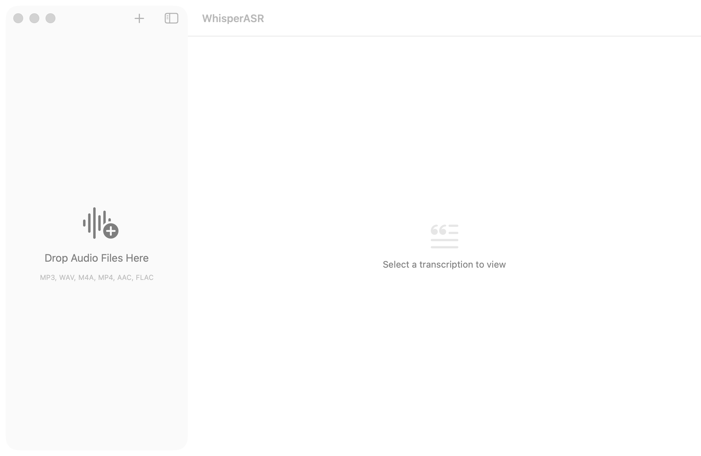

# WhisperASR

A native macOS app for audio transcription using [Breeze-ASR-25](https://github.com/mtkresearch/Breeze-ASR-25) (Whisper large-v2 fine-tuned for Taiwanese Mandarin and code-switching) via [whisper.cpp](https://github.com/ggml-org/whisper.cpp) with Metal GPU acceleration.



## Features

- **Drag-and-drop** audio/video files (MP3, WAV, M4A, MP4, AAC, FLAC, OGG, WMA, AIFF, CAF)
- **App audio recording** — capture audio from any running app via ScreenCaptureKit (M4A/AAC at 48 kHz)
- **Zoom meeting detection** — automatically prompts to stop recording when a Zoom meeting ends
- **Recent apps** — previously recorded apps appear at the top of the app picker
- **Metal GPU acceleration** via whisper.cpp for fast transcription
- **Sequential transcription queue** — files wait in queue and transcribe one at a time
- **Real-time progress** with estimated time remaining
- **Synced text highlighting** — the current sentence highlights as audio plays
- **Click-to-seek** — click any segment to jump to that point in the audio
- **Audio playback** with play/pause, seek bar, and skip ±5s controls
- **Export** transcriptions as SRT (subtitles) or plain text
- **Batch processing** — queue multiple files at once
- **Rename and copy** files from the sidebar context menu
- **Re-transcribe** and **retry on failure** with copyable error messages
- **Custom model path** — configure via Settings

## Requirements

- macOS 14.0+
- Apple Silicon Mac (arm64) — the included xcframework is built for arm64
- Python 3 with `torch`, `transformers`, `numpy`, `huggingface_hub` (for model conversion only)

## Setup

### 1. Build whisper.cpp (if not already included)

The repo includes a pre-built `CWhisper.xcframework`. To rebuild it from source:

```bash
bash Scripts/build_whisper_lib.sh
```

This clones whisper.cpp, builds it with Metal + Accelerate, and packages the static libraries into an xcframework.

### 2. Convert the Breeze-ASR-25 model

```bash
bash Scripts/convert_model.sh
```

This downloads the Breeze-ASR-25 model from HuggingFace (~3 GB), clones the necessary repos, and converts it to GGML format at `Models/ggml-model.bin`. Only needed once.

### 3. Build and run

```bash
swift build
swift run
```

Or open in Xcode:

```bash
open Package.swift
```

Then build and run from Xcode (Cmd+R).

## Usage

1. **Add files** — drag audio/video files onto the sidebar, or click the **+** button
2. **Record app audio** — click the record button, select a running app, and start recording; recently used apps are listed first
3. **Wait for transcription** — files are queued and transcribed one at a time with progress and ETA
4. **Review** — click a completed item to see the transcript with timestamps
5. **Play audio** — use the player controls at the bottom; text highlights in sync
6. **Export** — click the export button (top-right) to save as SRT or plain text

## Project Structure

```
Sources/
├── WhisperASRApp.swift        # App entry point
├── ContentView.swift          # NavigationSplitView layout
├── SidebarView.swift          # File list with drag-and-drop & context menu
├── DetailView.swift           # Transcript display, progress, export
├── PlayerView.swift           # Audio playback controls
├── RecordingView.swift        # App audio recording UI
├── AudioRecorder.swift        # ScreenCaptureKit audio capture
├── AppState.swift             # App state management & transcription queue
├── Models.swift               # Data models
├── TranscriptionService.swift # whisper.cpp C API integration
├── TranscriptionStore.swift   # JSON file-per-item persistence
├── AudioLoader.swift          # AVAssetReader audio loading
├── AudioPlayerManager.swift   # AVPlayer wrapper
└── SettingsView.swift         # Model path configuration
Scripts/
├── build_whisper_lib.sh       # Build whisper.cpp xcframework
└── convert_model.sh           # Convert HuggingFace model to GGML
Frameworks/
└── CWhisper.xcframework/      # Pre-built whisper.cpp static library
```

## License

This project uses [whisper.cpp](https://github.com/ggml-org/whisper.cpp) (MIT) and the [Breeze-ASR-25](https://github.com/mtkresearch/Breeze-ASR-25) model by MediaTek Research.
