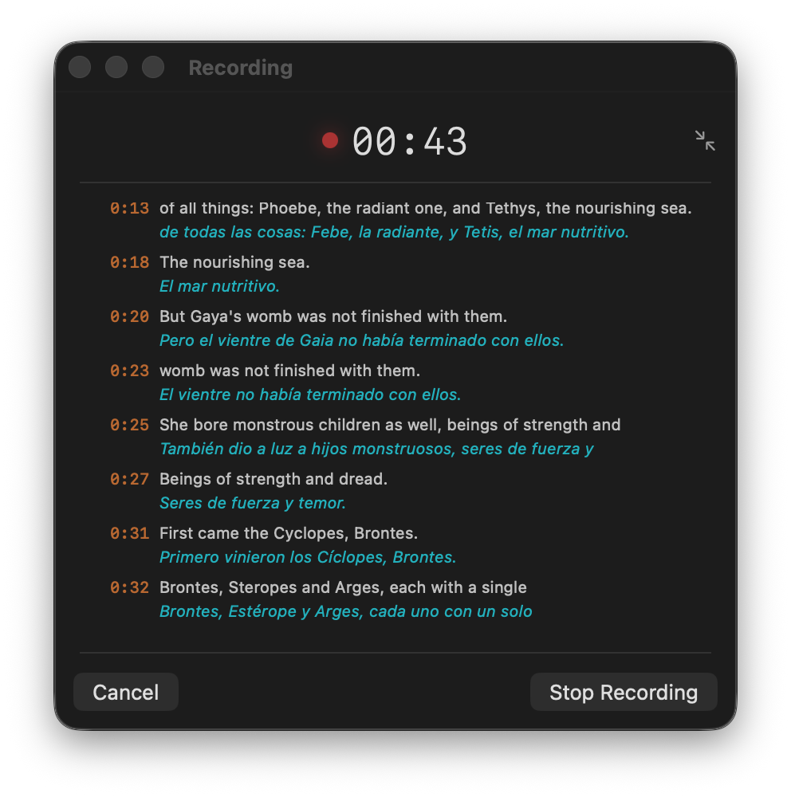
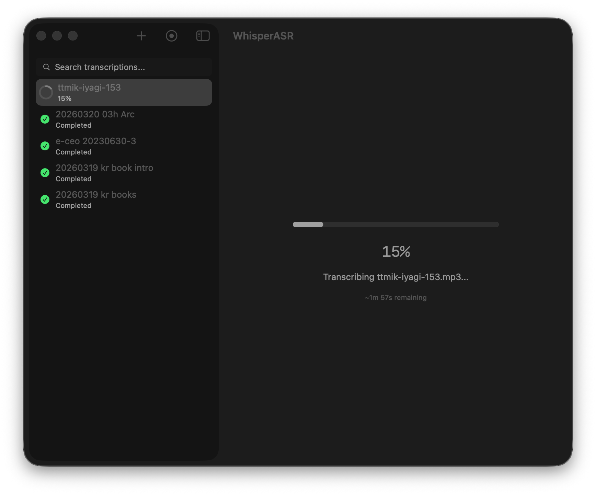
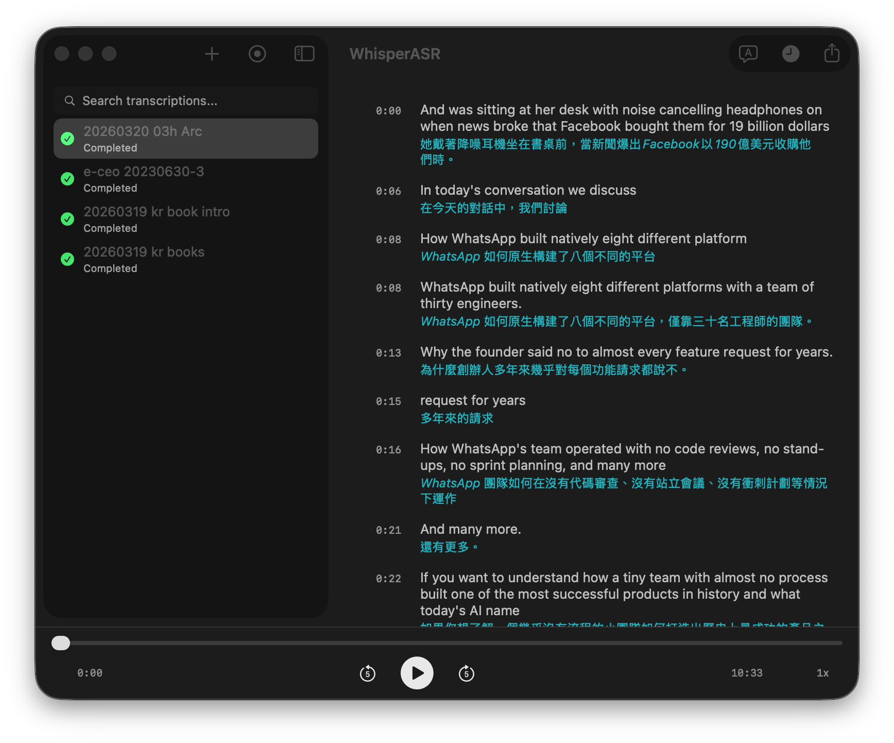
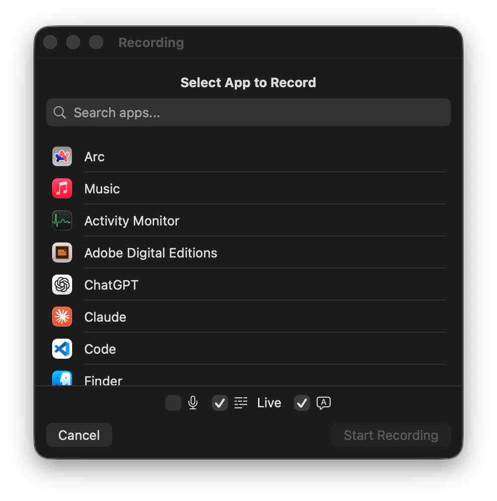
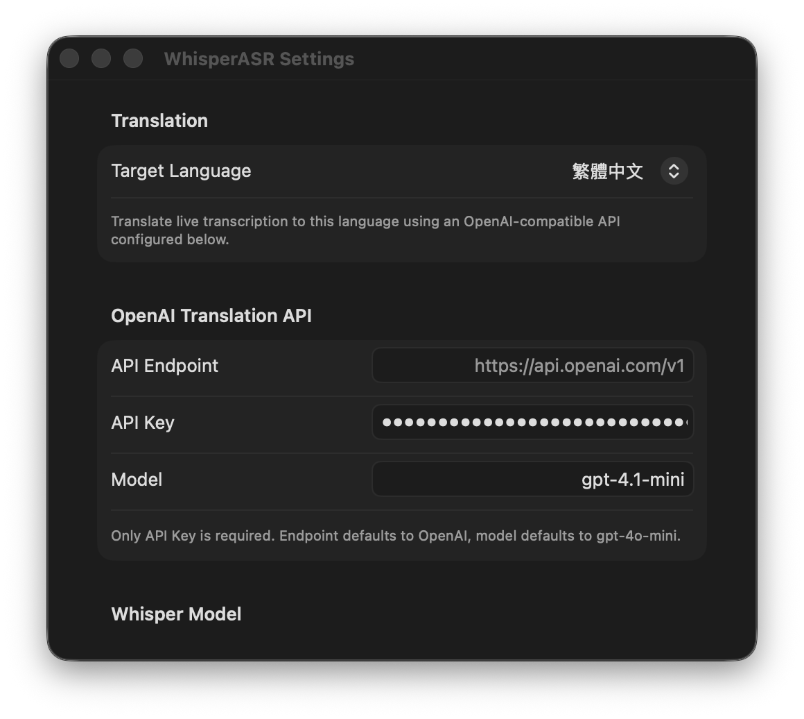

# WhisperASR

原生 macOS 语音转录应用，使用 [Breeze-ASR-25](https://github.com/mtkresearch/Breeze-ASR-25)（针对台湾华语与语码混用微调的 Whisper large-v2 模型），通过 [whisper.cpp](https://github.com/ggml-org/whisper.cpp) 搭配 Metal GPU 加速进行转录。



## 截图

| 转录进度 | 双语逐字稿 |
|---|---|
|  |  |

| 应用选择 | 设置 |
|---|---|
|  |  |

## 功能

### 实时转录＋翻译

- **应用音频录制** — 通过 ScreenCaptureKit 录制任何运行中应用的音频（M4A/AAC，48 kHz）
- **实时转录** — 录音时同步显示转录文字
- **实时翻译** — 每段转录文字下方实时显示翻译，通过 OpenAI 兼容 API 实现
- **智能自动滚动** — 实时转录画面自动跟随最新段落
- **实时结果保留** — 停止录音后直接保留实时转录结果，无需重新转录
- **Zoom 会议检测** — Zoom 会议结束时自动提示停止录音

### 文件转录

- **拖放上传** 音频／视频文件（MP3、WAV、M4A、MP4、AAC、FLAC、OGG、WMA、AIFF、CAF）
- **批量处理** — 一次队列多个文件
- **顺序转录队列** — 文件依次一个一个转录

### 双语输出

- **转录后翻译** — 一键将完成的逐字稿翻译成任何设置语言
- **语言设置** — 自动检测或手动指定来源语言；选择目标翻译语言
- **搜索** — 侧边栏全局筛选所有转录，或按 Cmd+F 在逐字稿内搜索并高亮显示

### 播放

- **音频播放** — 播放／暂停、进度条、前后跳 ±5 秒
- **同步高亮** — 播放时自动高亮当前句子
- **点击跳转** — 点击任意段落即跳至该时间点

### 模型

- **内置模型下载** — 在 App 内直接下载模型：Breeze-ASR-25（最适合台湾华语）以及官方 whisper.cpp 模型，从 Tiny（78 MB）到 Large v3 Turbo（1.6 GB）
- **随时切换** — 从工具栏或设置选择使用的模型，下次转录即生效
- **自定义模型路径** — 也可在设置中指定目录外的 `ggml-*.bin` 模型文件

### 本地 API 服务器（兼容 OpenAI）

- **可直接替换的 OpenAI 转录 API** — 在设置中启用本地 HTTP 服务器，将任何兼容 OpenAI 的客户端指向 `http://127.0.0.1:8080/v1`；转录在设备上以你选择的模型执行
- **端点** — `POST /v1/audio/transcriptions`、`POST /v1/audio/translations`（将音频翻译成英文）与 `GET /v1/models`
- **响应格式** — `json`、`verbose_json`（含时间轴片段）、`text`、`srt` 与 `vtt`
- **可选 API 密钥** — 可要求 `Bearer` 令牌，并可选择开放区域网络内其他设备访问

### 隐私与性能

- **Metal GPU 加速** — 通过 whisper.cpp 完全在设备上执行，音频不会离开你的 Mac
- **自备 API** — 翻译支持任何 OpenAI 兼容端点，包括本地模型
- **重新转录** 与 **失败重试**，可复制错误消息

## 系统需求

- macOS 14.0 以上
- Apple Silicon Mac（arm64）— 内含的 xcframework 为 arm64 版本
- Python 3 及 `torch`、`transformers`、`numpy`、`huggingface_hub`（仅自行转换模型时需要；下载预先转换的 GGML 文件则不需要）

## 安装设置

### 1. 构建 whisper.cpp（若尚未包含）

项目已内含预先构建的 `CWhisper.xcframework`。如需从源码重新构建：

```bash
bash Scripts/build_whisper_lib.sh
```

此命令会复制 whisper.cpp、以 Metal + Accelerate 构建，并封装静态库为 xcframework。

### 2. 获取语音识别模型

**方法 A（推荐）：** 直接启动 App — 首次运行会提示下载模型（Breeze-ASR-25 或较小的 Whisper 模型），之后可在「设置 → 语音识别模型」中新增、选择或删除模型。

**方法 B：** 直接从 HuggingFace 下载预先转换的 Breeze-ASR-25 GGML 文件（约 3 GB），放至 `Models/ggml-model.bin`：

```
https://huggingface.co/danielkao0421/Breeze-ASR-25-ggml/blob/main/ggml-model.bin
```

**方法 C：** 从原始模型自行转换（需要 Python 3 及 `torch`、`transformers`、`numpy`、`huggingface_hub`）：

```bash
bash Scripts/convert_model.sh
```

此命令会从 HuggingFace 下载 Breeze-ASR-25 模型、复制所需的 repo，并将其转换为 GGML 格式存至 `Models/ggml-model.bin`。

### 3. 构建并运行

```bash
swift build
swift run
```

或以 Xcode 打开：

```bash
open Package.swift
```

在 Xcode 中按 Cmd+R 构建并运行。

### 4. 构建发布版 app bundle（可选）

```bash
bash Scripts/build_release.sh
```

此命令会构建优化的发布版可执行文件、生成正确的 `.icns` 图标，并封装为含 Info.plist 的 `WhisperASR.app`。安装方式：

```bash
cp -r WhisperASR.app /Applications/
```

若 macOS 显示「无法打开」警告（因为 app 未经签名），请将以下命令中的路径替换为 `WhisperASR.app` 的实际位置后执行：

```bash
xattr -cr /path/to/WhisperASR.app
```

## 使用方式

1. **新增文件** — 将音频／视频文件拖至侧边栏，或点击 **+** 按钮
2. **录制应用音频** — 点击录音按钮，选择运行中的应用后开始录音；最近使用的应用会排在最前面
3. **实时转录与翻译** — 在录音对话框中启用实时转录，录音时即可看到文字；在设置中设置目标语言，可在每段下方看到实时翻译
4. **等待转录** — 文件会排入队列，依次转录并显示进度与预估剩余时间
5. **查看** — 点击已完成项目，查看含时间戳的逐字稿
6. **翻译** — 点击翻译按钮，将完成的逐字稿翻译成任何设置语言
7. **搜索** — 使用侧边栏搜索栏筛选所有文件，或按 Cmd+F 在逐字稿中搜索
8. **播放音频** — 使用底部播放器控制；文字会同步高亮显示
9. **导出** — 点击右上角导出按钮，保存为 SRT 或纯文本格式

### 设置

打开**设置**（Cmd+,）进行设置：

- **目标语言** — 选择翻译的目标语言
- **OpenAI 翻译 API** — 只需填入 API 密钥；端点默认为 OpenAI，模型默认为 `gpt-4o-mini`。支持任何 OpenAI 兼容端点（包括本地模型）。
- **语音识别模型** — 下载、选择或删除模型；转录会使用选取的模型
- **自定义模型** — 可选的自定义 `ggml-*.bin` 模型文件路径，仅在未选取下载模型时使用

## 项目结构

```
Sources/
├── WhisperASRApp.swift        # 应用入口
├── ContentView.swift          # NavigationSplitView 布局
├── SidebarView.swift          # 文件列表，支持拖放与右键菜单
├── DetailView.swift           # 逐字稿显示、进度、导出
├── PlayerView.swift           # 音频播放控制
├── RecordingView.swift        # 应用音频录制 UI
├── AudioRecorder.swift        # ScreenCaptureKit 音频捕获
├── AppState.swift             # 应用状态管理与转录队列
├── Models.swift               # 数据模型
├── TranscriptionService.swift # whisper.cpp C API 整合
├── TranslationService.swift   # OpenAI 兼容翻译 API
├── TranscriptionStore.swift   # JSON 逐项持久化存储
├── AudioLoader.swift          # AVAssetReader 音频加载
├── AudioPlayerManager.swift   # AVPlayer 封装
├── AppIconGenerator.swift     # 程序化应用图标生成
└── SettingsView.swift         # 语言、翻译与模型设置
Scripts/
├── build_whisper_lib.sh       # 构建 whisper.cpp xcframework
├── convert_model.sh           # 将 HuggingFace 模型转换为 GGML
└── build_release.sh           # 构建含图标的发布版 .app bundle
Frameworks/
└── CWhisper.xcframework/      # 预先构建的 whisper.cpp 静态库
```

## 许可

本项目使用 [whisper.cpp](https://github.com/ggml-org/whisper.cpp)（MIT 许可）及联发科研究院的 [Breeze-ASR-25](https://github.com/mtkresearch/Breeze-ASR-25) 模型。
