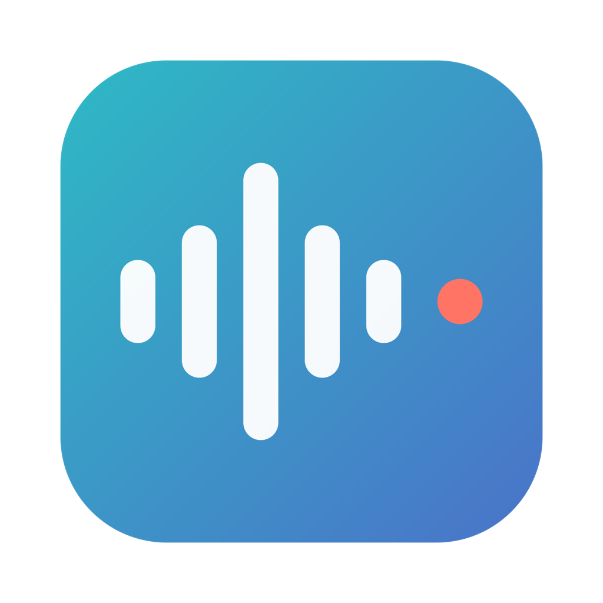
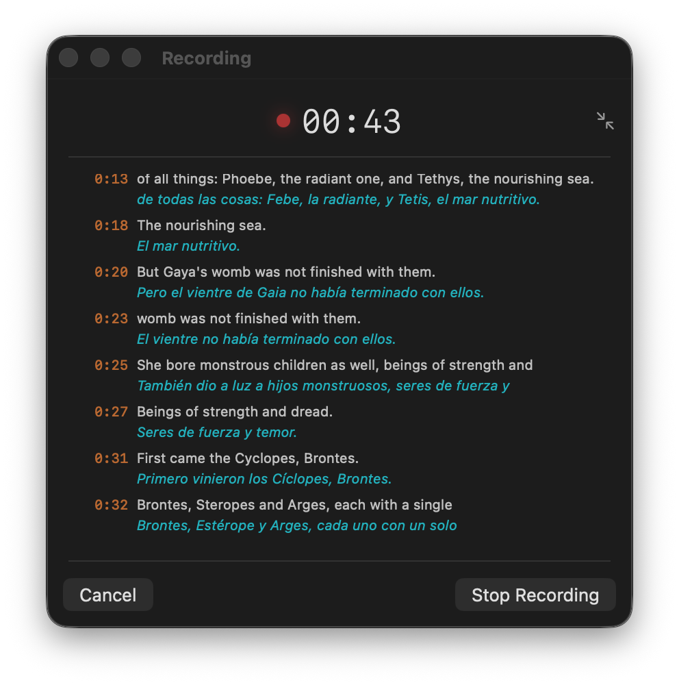
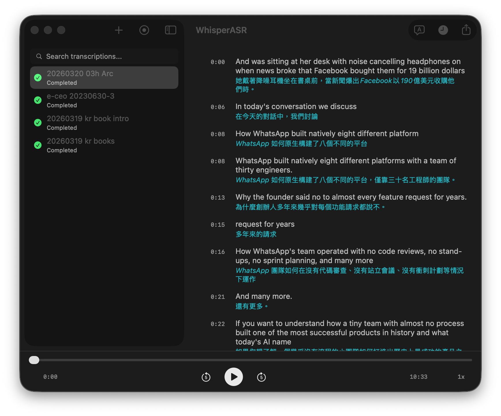
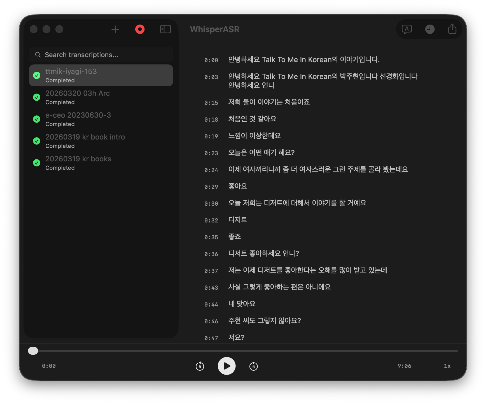
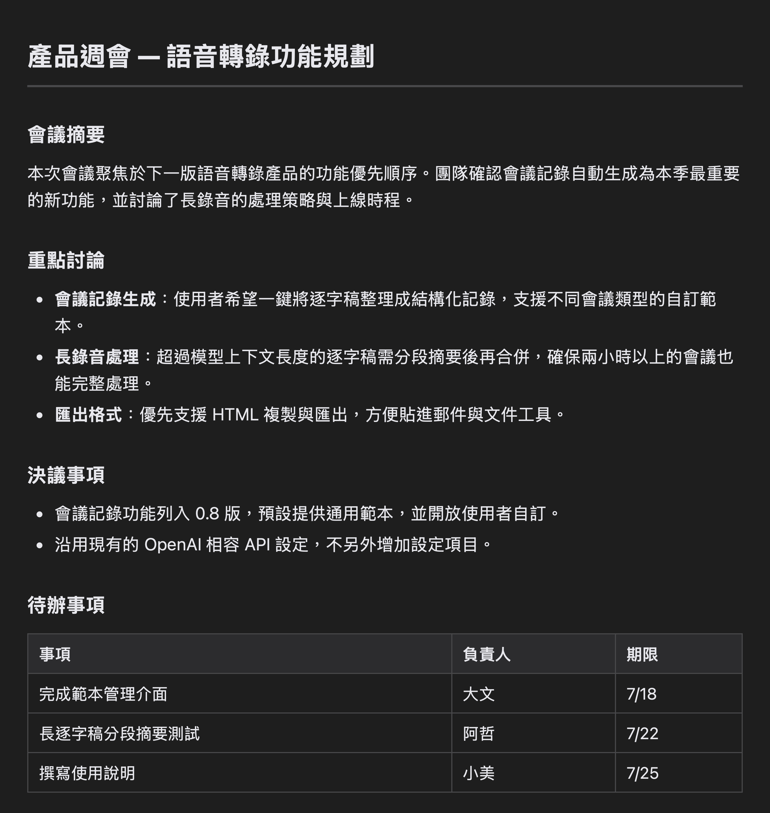
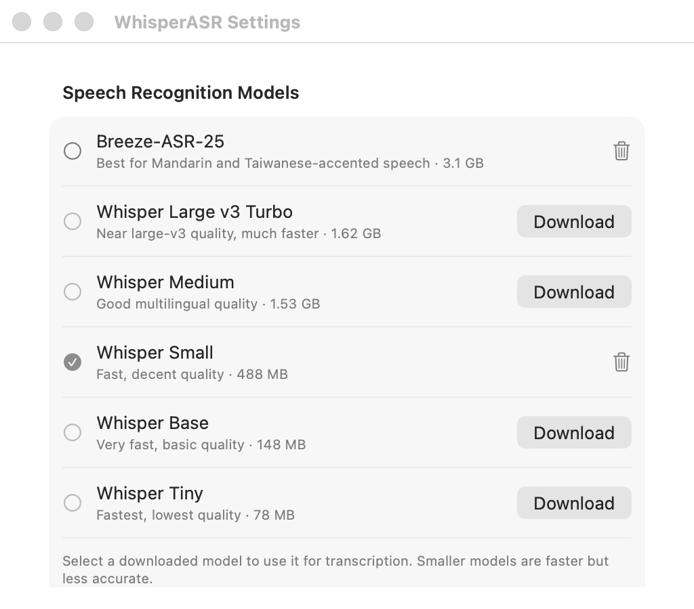
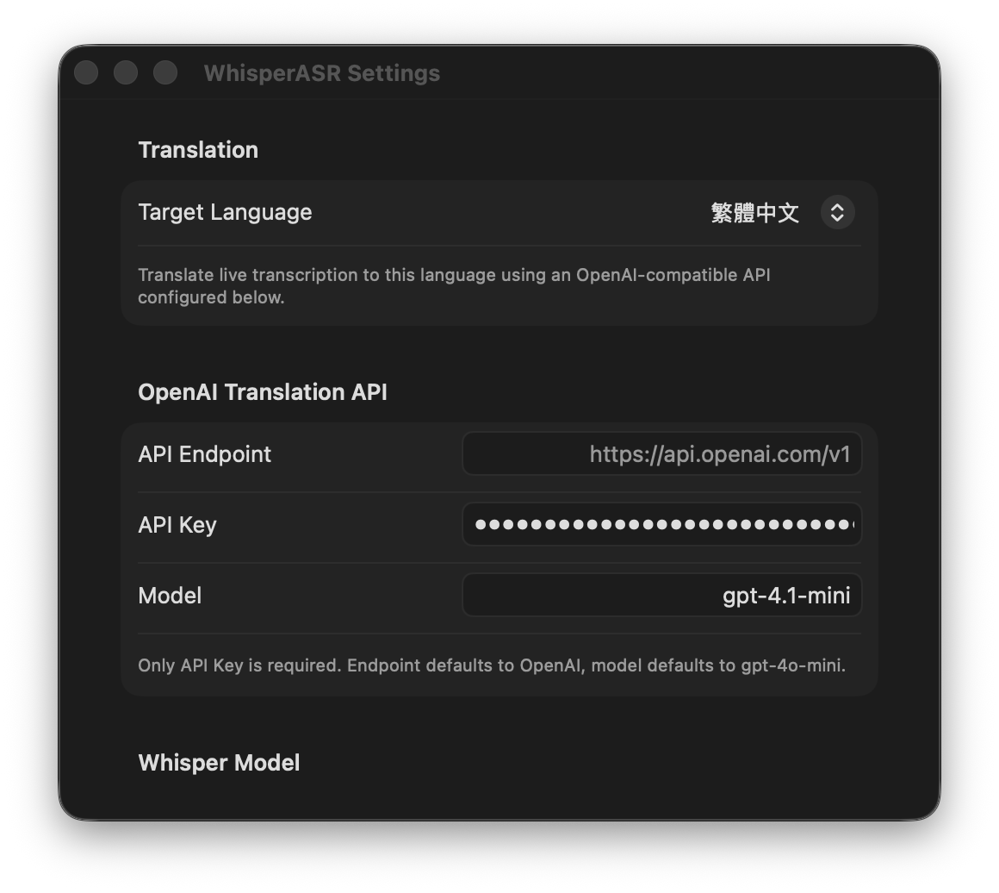
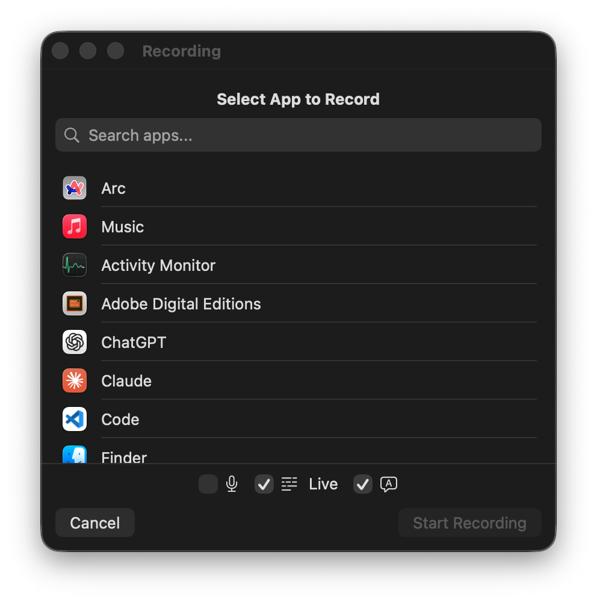
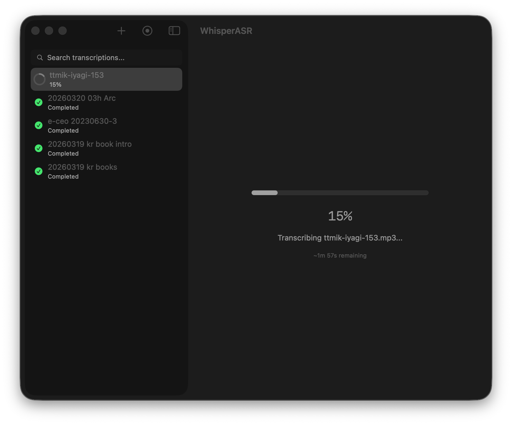

# 声记 SonicScribe

> 内部标识（Swift Package 模块名、Application Support 目录、日志目录）仍为
> `WhisperASR`——改名只动对外的品牌与 bundle 标识，不动数据目录，
> 以免用户既有历史记录与模型需要迁移。

<p align="center">
  
</p>

<p align="center">
  <strong>专为 macOS 打造的高性能全能离线/在线语音转录、实时字幕与双语翻译工作台</strong>
</p>

<p align="center">
  <a href="README.md">English</a> | 简体中文
</p>

---

## 🌟 核心亮点

声记 SonicScribe 是一款深度融合 macOS 原生生态的高性能音频转录与实时字幕工具，支持**全离线硬件加速（Metal GPU + Apple Neural Engine）**与**在线大模型**，提供从应用音频内录、实时悬浮字幕、多引擎流式识别、大模型实时翻译到智能会议纪要的一站式工作流。

```
[ App / Mic 音频输入 ] ──► [ Silero 神经 VAD + 自适应切片 ] ──► [ 多引擎 ASR 分发 ]
                                                                       │
┌─────────────────────────────── 实时输出管线 ─────────────────────────┴────────────────┐
│                                                                                       │
│   ┌───────────────────────────┐      ┌───────────────────────────┐                    │
│   │   一体化悬浮字幕 (Metal)   │      │   LLM / 原生双语翻译     │                    │
│   │   (自由拖拽/缩放/置顶)    │ ◄────┤   (流式打字机 + 智能纠错) │                    │
│   └─────────────┬─────────────┘      └─────────────▲─────────────┘                    │
│                 │                                  │                                  │
│                 ▼                                  │                                  │
│   ┌───────────────────────────┐      ┌─────────────┴─────────────┐                    │
│   │   OBS / 直播透明推流通道  │      │   OpenAI 兼容本地 API 服务 │                    │
│   └───────────────────────────┘      └───────────────────────────┘                    │
└───────────────────────────────────────────────────────────────────────────────────────┘
```

---

## 📸 界面截图

| 实时转录与双语字幕 | 双语逐字稿 |
|---|---|
|  |  |

| 逐字稿与音频同步播放 | AI 会议纪要 |
|---|---|
|  |  |

| 语音识别模型管理 | 设置页面 |
|---|---|
|  |  |

| 应用音频选择 | 转录进度 |
|---|---|
|  |  |

> 截图为更早版本所摄，窗口标题仍显示 `WhisperASR`；产品随后更名为声记
> SonicScribe（见文件开头的说明）。

---

## 🚀 核心功能特性

### 1. 🎙️ 全能多引擎 ASR 矩阵
支持根据使用场景一键切换识别引擎，兼顾极低延迟与极高准确率：

| 引擎 | 加速核心 | 特性与适用场景 |
|---|---|---|
| 🍎 **Apple 原生语音识别** | macOS SpeechAnalyzer | **0 显存占用，毫秒级流式响应**；系统级离线出字，极速轻量 |
| ⚡ **Qwen3-ASR** | Metal GPU (transcribe.cpp) | 0.6B / 1.7B GGUF 架构，中文、方言及复杂术语识别效果极佳 |
| 🧠 **NVIDIA Nemotron 3.5** | Apple Neural Engine (Core ML) | 专为 ANE 优化，40+ 语言原生标点输出，功耗极低 |
| 🚀 **Whisper.cpp** | Metal GPU | 支持 Tiny ~ Large-v3 Turbo 及微调模型（如 Breeze-ASR 台湾华语） |
| 🎯 **FunASR** | Sherpa-ONNX (CPU/NEON) | 支持 SenseVoice-Small 与 Paraformer，多语言富文本高鲁棒性 |
| 🌐 **在线 API 识别** | 云端服务 | 支持 OpenAI Whisper API、小米 MiMo ASR（流式 SSE 逐 chunk 返回） |
| 🖥️ **局域网远程 ASR** | 远端 GPU 算力 | 直连局域网自建 faster-whisper / vLLM 端点，释放 Mac 本地负载 |

### 2. 🪟 一体化悬浮字幕与实时翻译（Floating Letter Overlay）
- **胶囊化悬浮控制台**：无边框精致浮层，集成目标应用选择、麦克风混音切换、识别/翻译开关、字体字号调节与窗口置顶。
- **双语同传实时显示**：转录原文与译文分层渲染，单句流式打字机效果，整句封口自动对齐。
- **智能 ASR 容错翻译**：翻译 Prompt 注入上下文与常识纠错机制，消除 ASR 偶发同音错字对译文的影响。
- **场景化 Prompt 预设库**：内置「视频字幕」、「商务会议」、「学术演讲」、「日常交流」等多种风格模板，支持变量替换。
- **OBS 直播穿透支持**：内置 OBS / Cleanfeed 绿幕与透明色度键（Chroma Key）独立字幕输出窗口。

### 3. 🔊 智能音频流与神经语音检测（Smart Audio & VAD）
- **应用级音频回环内录**：基于 ScreenCaptureKit 捕获任意单应用音频，无需安装 Virtual Audio Cable 虚拟声卡驱动。
- **双路无损混音**：系统应用音频与麦克风智能混合，支持 Zoom 会议生命周期自动检测与停录提醒。
- **Silero 神经 VAD + 自适应底噪**：结合 Silero 神经网络人声检测与过零率（ZCR）/能量双重滤波，自适应估算环境噪声底，平滑能量谷值智能封口。
- **$O(1)$ 摊还缓冲修剪**：高并发低延迟音频队列，锁粒度收窄至微秒级切片，杜绝长时间录制下的 Drop Frames 丢帧隐患。

### 4. 📝 逐字稿精细播放与 AI 会议纪要
- **带时间戳的交互逐字稿**：支持段落高亮同步音频波形，点击任意文本句即刻跳转到对应音频时间点播放。
- **AI 结构化会议纪要**：一键提炼核心议题、决议事项与待办行动清单（Action Items），支持自定义提示词与上下文轮数。
- **多格式一键导出**：支持导出标准 `SRT`、`VTT` 字幕、`Markdown`、`TXT` 纯文本以及 `JSON` 结构化数据。

### 5. 🔌 本地 OpenAI 兼容 API 服务器
App 内置轻量级高性能 HTTP API 服务，可将你的 Mac 瞬间变为兼容 OpenAI 规范的局域网/本机 ASR 算力中心：
- **兼容端点**：
  - `POST /v1/audio/transcriptions`（转录文件，支持 `json` / `verbose_json` / `text` / `srt` / `vtt`）
  - `POST /v1/audio/translations`（转录并翻译）
  - `GET /v1/models`（模型列表）
- **无缝集成第三方工具**：可在沉浸式翻译、NextChat、Bob、Raycast、ChatBox 等工具中直接配置 `http://127.0.0.1:8080/v1` 作为语音识别服务。

---

## 🛠️ 系统要求

- **操作系统**：macOS 14.0 (Sonoma) 或更高版本（Apple 原生语音分析推荐 macOS 15+ / 26）
- **硬件架构**：Apple Silicon Mac（M1 / M2 / M3 / M4 系列芯片）
- **开发工具**：Xcode 15+ / Swift 5.9+ 工具链

---

## 📦 编译与运行

### 快速通过 Swift Package Manager 编译运行

```bash
# 1. 克隆项目仓库
git clone https://github.com/your-repo/SonicScribe.git
cd SonicScribe

# 2. 编译可执行文件
# 需要 Xcode 工具链（SwiftUI 宏只随 Xcode 提供）。若 `xcode-select -p` 指向
# CommandLineTools，请加前缀 DEVELOPER_DIR=/Applications/Xcode.app/Contents/Developer
swift build -c release

# 3. 运行 SonicScribe
.build/release/WhisperASR
```

### 运行单元测试集（331 个测试用例保障）

```bash
DEVELOPER_DIR=/Applications/Xcode.app/Contents/Developer swift test
```

---

## 🧪 测试与基准评测

除单元测试外，可通过 `Scripts/sonic_asr_mcp.py` 从任意 MCP 客户端驱动并评测端上引擎：

| 工具 | 用途 |
|---|---|
| `list_models` | 枚举可选引擎及其就绪状态、语言覆盖与阻塞原因；`probe=true` 会真正加载每个引擎并报出实测加载耗时 |
| `get_asr_status` | 引擎就绪状态、模型路径与当前生效配置 |
| `update_engine_config` | 热切换引擎与其超参数；未知参数会被明确拒绝，而不是静默忽略 |
| `transcribe_file` | 单次整段转录。`reference=` 可就地返回 CER；`task="translate"` 执行到英文的语音翻译（仅 whisper 引擎） |
| `stream_transcribe` | 按分片到达时间线重放（丢包／抖动／乱序），逐片输出 partial 与 final 事件 |
| `benchmark_models` | 引擎 × 音频文件交叉测量，返回加载耗时、推理耗时、RTF、文本与 CER |

可运行的引擎取决于 `~/Library/Application Support/WhisperASR/Models` 下实际存在的文件；
`list_models(probe=true)` 报告的是**真正能加载**的引擎，而非仅仅是文件存在。whisper 系列
引擎通过 `whisper-cli` 可执行文件驱动——可从随仓库的 `.whisper.cpp` 编译
（`cmake -B build .whisper.cpp && cmake --build build -j --target whisper-cli`），
或用 `WHISPER_CLI` 环境变量指向已有二进制。

> **关于内置评测语料。** 种子生成的音频是**合成**的类语音波形——以音节率的幅度包络
> 调制共振峰音并叠加底噪。它们刻意不构成可懂语音，因此适合压测管道（分块、丢包、
> TTFT、尾包延迟、字幕抖动），但**不能**用于衡量识别准确率：任何引擎在其上的错误率
> 都是 100%。准确率评测需要真实录音——`.transcribe.cpp/samples/` 提供了中文、日文、
> 韩文、粤语、俄语、德语与英文的真实语音。

---

## 📂 项目结构概览

```
SonicScribe/
├── Sources/
│   ├── App/                              # 应用主入口、全局状态与视图层
│   │   ├── WhisperASRApp.swift           # SwiftUI App 入口与生命周期配置
│   │   ├── AppState.swift                # 全局 @Observable 响应式状态管理
│   │   ├── AppRuntimeManager.swift       # 核心服务编排与生命周期驱动中心
│   │   ├── ConfigurationManager.swift    # 统一设置数据持久化中心
│   │   ├── ContentView.swift             # 主界面布局
│   │   ├── SidebarView.swift             # 历史记录列表侧边栏
│   │   ├── DetailView.swift              # 逐字稿详情与双语对照视图
│   │   ├── PlayerView.swift              # 交互式音频波形与同步播放控件
│   │   ├── MinutesWindowView.swift       # AI 会议纪要生成窗口
│   │   └── Settings/                     # 模块化设置页面组 (7大独立子模块)
│   │       ├── GeneralSettingsPage.swift
│   │       ├── RecognitionSettingsPage.swift
│   │       ├── TranslationSettingsPage.swift
│   │       ├── CaptionSettingsPage.swift
│   │       ├── AudioSettingsPage.swift
│   │       ├── HistorySettingsPage.swift
│   │       └── SystemStatusSettingsPage.swift
│   └── Pipeline/                         # 核心业务管线模块
│       ├── ASR/                          # 语音识别门面与多引擎 Provider 适配
│       │   ├── TranscriptionService.swift# ASR 分发调度核心
│       │   ├── ASRManager.swift          # 实时识别循环、看门狗与自动降级
│       │   ├── WhisperProvider.swift     # whisper.cpp (Metal) 桥接适配
│       │   ├── QwenProvider.swift        # Qwen3-ASR (0.6B/1.7B) 后端
│       │   ├── NemotronProvider.swift    # NVIDIA Nemotron (Core ML/ANE) 适配
│       │   ├── FunASR/                   # Sherpa-ONNX 运行时与 Paraformer/SenseVoice
│       │   ├── AppleServices/            # 原生 SpeechAnalyzer 与 TranslationSession
│       │   └── APIServer.swift           # OpenAI 兼容 HTTP 转录服务端
│       ├── Audio/                        # 音频采集与预处理
│       │   ├── AudioRecorder.swift       # ScreenCaptureKit 音频捕获与 O(1) 缓冲池
│       │   ├── AudioLoader.swift         # 多格式音频解码与流式 FFmpeg 后备
│       │   └── SherpaVAD.swift           # Silero 神经 VAD 增强判定
│       ├── Subtitle/                     # 实时字幕与悬浮窗
│       │   ├── SubtitleManager.swift     # partial/final 字幕状态机与环形窗口
│       │   ├── FloatingLetter/           # 一体化无边框悬浮胶囊 Overlay
│       │   └── ObsSubtitleWindowController.swift # OBS 绿幕推流输出
│       ├── Translation/                  # 翻译抽象层与模型路由
│       │   ├── TranslationManager.swift  # 单句流式 / 批量对齐翻译管理器
│       │   ├── TranslationService.swift  # OpenAI 格式 HTTP SSE 客户端
│       │   └── PromptBuilder.swift       # 变量化翻译 Prompt 模板引擎
│       └── History/                      # 记录存储与持久化
│           ├── HistoryManager.swift      # 历史记录内存缓存与操作收口
│           ├── TranscriptionStore.swift  # 多核并发 JSON 存储与懒加载
│           └── MeetingMinutesService.swift# 会议纪要提取服务
├── Frameworks/                           # 原生二进制 XCFramework 静态库
│   ├── CWhisper.xcframework              # whisper.cpp + Metal
│   ├── CTranscribe.xcframework           # transcribe.cpp (Qwen3-ASR Metal)
│   └── SherpaONNX.xcframework            # sherpa-onnx + onnxruntime
├── Tests/                                # 纯逻辑单元测试套件（331 个用例）
├── Scripts/                              # 构建、发布、图标与基准评测工具
│   ├── build_release.sh                  # 发布打包；将品牌变量写入 Info.plist
│   ├── build_whisper_lib.sh              # 重新编译 CWhisper.xcframework
│   ├── build_transcribe_lib.sh           # 重新编译 CTranscribe.xcframework
│   ├── convert_model.sh                  # 模型格式转换辅助脚本
│   ├── generate_icon.swift               # 程序化生成应用图标 -> Assets/icon_1024.png
│   └── sonic_asr_mcp.py                  # 暴露端上引擎的 MCP 服务
└── docs/                                 # 架构设计、原理图与开发交接文档
```

---

## 🔗 URL Scheme 与自动化

声记 SonicScribe 支持通过 macOS URL Scheme 进行快捷控制与自动化集成：

| URL 命令 | 说明 | 示例 |
|---|---|---|
| `sonicscribe://record?app=Zoom` | 自动匹配并启动指定应用的录音与实时字幕 | `open "sonicscribe://record?app=Zoom&mic=true&translate=true"` |
| `sonicscribe://record` | 打开一体化应用选择与录音悬浮窗 | `open "sonicscribe://record"` |

旧 `whisperasr://` scheme 会一并注册，既有快捷方式继续可用。接受的 scheme 从
`Info.plist`（由 `Scripts/build_release.sh` 按品牌参数写入）读取，而非硬编码——
以后改名只需改构建脚本里的品牌变量，代码无需改动。

---

## 📄 开源许可证与署名

**声记 SonicScribe 是基于 [whisperASR](https://github.com/plateaukao/whisperASR) 的衍生作品，采用 Apache License 2.0 协议**——与上游项目一致。详见 [LICENSE](LICENSE) 与 [NOTICE](NOTICE)。

Apache-2.0 虽然是宽松协议，但**不允许**衍生作品改用其他协议发布。因此本项目保持 Apache-2.0，**不应被描述为 MIT**。

### 上游血缘

| 仓库 | 角色 |
|---|---|
| [plateaukao/whisperASR](https://github.com/plateaukao/whisperASR) | 原始项目 © Daniel Kao |
| [shimianmaifu11-collab/whisperASR](https://github.com/shimianmaifu11-collab/whisperASR) | Fork |
| [celiankk/whisperASR](https://github.com/celiankk/whisperASR) | Fork —— 本仓库的 `origin` |

上游 `LICENSE` 原样保留。依据 Apache-2.0 第 4(b) 条，[NOTICE](NOTICE) 记录本仓库文件已对上游作品作出实质性修改——更名 SonicScribe、多引擎 ASR 层、翻译管线、悬浮字幕、设置重组、会议纪要服务与基准评测工具均为在上游基础上新增或重写。

### 第三方组件

| 组件 | 协议 |
|---|---|
| [whisper.cpp](https://github.com/ggml-org/whisper.cpp) | MIT |
| [sherpa-onnx](https://github.com/k2-fsa/sherpa-onnx) | Apache 2.0 |
| [onnxruntime](https://github.com/microsoft/onnxruntime) | MIT |
| [FluidAudio](https://github.com/FluidInference/FluidAudio) | Apache 2.0 |

语音识别模型于运行时下载，不随本仓库分发。各模型遵循其自身的授权条款——商用前请查阅对应模型卡。
