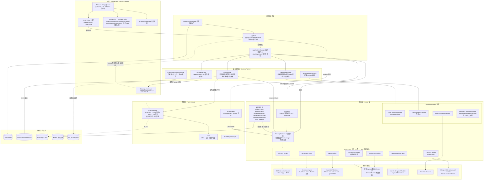
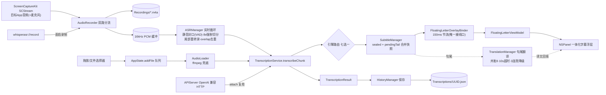

# WhisperASR 当前架构图

> 生成日期：2026-09-19（对应分支 `重构整体`，HEAD `2e16919 fix: correct Apple Translation version claim in mode picker` + 未提交工作区改动）
>
> 反映重构后的目录分层：`Sources/App`（UI + 状态）与 `Sources/Pipeline`(业务管线)。
> 旧版架构文档见 `docs/软件原理图.md`（对应 `正式版1.4` 分支，AppState 尚未拆分，已过时）。
>
> **本文未反映的后续改动**（图仍以 08-22 的分层为骨架，下列已落地但未重画）：
> 延迟看板（`Settings/LatencyDashboardView` + `PipelineLatencyStore`，端到端/推理耗时插桩）、
> Metal SDF 字幕渲染器（`FloatingLetter/MetalSubtitleRenderer` + `SDFGlyphAtlas`，实现与单测齐全但**未接线**）、
> `SPSCFloatRingBuffer` / `RealtimeAudioIngest`（无锁实时音频环，未接线）、
> `KVCache/`（`KVCacheSession` / `MLXKVBackend`，预留未接线）、
> Onboarding（`Sources/App/Onboarding`）、设计令牌（`Sources/App/DesignTokens`）、
> `SourcesC/CRealtimeAtomics`（实时路径原子量 C target）。
> 识别结果统一层 `ASRResultNormalizer` + `NormalizedASRResult` 也已成为字幕层唯一输入（禁止 `if engine` 分支）。

## 一、分层架构总览

## 二、核心数据流

### 链路说明

1. **实时链路（核心）**：`SCStream` → `AudioRecorder`（m4a 写盘 + 16kHz PCM 双路分流）→ `ASRManager` 实时循环 → `TranscriptionService.transcribeChunk` → 引擎七选一 → `ASRResultNormalizer` 归一 → `SubtitleManager` 合并 partial/sealed → 浮层渲染；句尾触发 `TranslationManager` 整句翻译。
2. **离线链路**：拖放/选择器 → `AppState.addFile` 队列 → `AudioLoader` 解码（WebM/Opus 等由 ffmpeg 兜底）→ `transcribe(fileURL:)` → `HistoryManager` → `<UUID>.json` 持久化。
3. **外部接入**：`whisperasr://record` URL Scheme 直启录制；其他 App 经 `APIServer`（`POST /v1/audio/transcriptions` / `/v1/audio/translations`、`GET /v1/models`）复用同一个 `TranscriptionService`，模型只加载一份。

## 三、本次重构的关键变化

1. **AppState 瘦身**：只保留页面状态（历史列表、选中项、live UI 状态、字幕样式偏好）；识别循环、翻译请求、API 调用、模型加载全部禁止在 AppState 内处理。
2. **运行调度中心**：`AppRuntimeManager` 统一持有并编排 `ASRManager` / `TranslationManager` / `SubtitleManager` / `TranscriptionService` / `APIServer`，启动时 `attach(appState:)` 以弱引用回写 UI 状态。
3. **Provider 协议化**：
   - ASR：`TranscriptionService` 仅面向 `ASRProvider` 协议调度，**七个** Provider——whisper.cpp（CWhisper）、Nemotron（Core ML/ANE）、Qwen3-ASR（CTranscribe/ggml+Metal）、在线 OpenAI 兼容 API、Remote（局域网自托管端点）、Apple Speech（macOS 26 SpeechAnalyzer）、FunASR（sherpa-onnx：SenseVoice/Paraformer/Nano）；用户选择优先，`auto` 按模型文件类型自动路由；连续失败可自动降级到 Apple 引擎。出口统一经 `ASRResultNormalizer` → `NormalizedASRResult`（字幕层禁止 `if engine` 分支）。
   - 翻译：`TranslationManager` 按 `TranslationMode` 分发到 `LocalTranslationProvider`（LM Studio/Ollama）/ `ChatCompletionProvider`（在线 API）/ `AppleTranslationManager`（TranslationSession）/ `FreeWebTranslationProvider`（Google v1、Google v2、微软三条**免 API Key** 公共通道），有界并发队列 + 超时兜底 + 3 连败自动降级「仅识别模式」。
4. **字幕数据收口**：`SubtitleManager` 统一管理 sealed/pendingTail 字幕缓存（环形窗口，显示 100 条 / sealed 200 条），`SubtitleEngine` 负责生命周期、刷新节流（100~200ms 批量）与健康监控。
5. **浮层刻意解耦**：`Pipeline/Subtitle/FloatingLetter` 是零业务依赖的可复用组件，唯一接线口是 `FloatingLetterOverlayBinder`（观察 AppState/AudioRecorder → 150ms 节流推送）。
6. **历史数据单一出入口**：所有增删改查经 `TranscriptionHistoryManager`（上限 500 条裁剪；应用录音删除进废纸篓可恢复，导入文件不动磁盘）。
7. **持久化分两半**：UserDefaults（设置，`ConfigurationManager` 数据中心）+ 逐条 JSON 文件（转录数据）；实时会话另有 `live_recovery.json` 崩溃恢复。

## 四、外部依赖

| 依赖 | 用途 |
|---|---|
| `CWhisper.xcframework` | whisper.cpp 本地推理（Metal + Accelerate） |
| `CTranscribe.xcframework` | Qwen3-ASR ggml 推理（Metal） |
| `SherpaONNX.xcframework` | FunASR（SenseVoice / Paraformer / Nano）推理 |
| [FluidAudio](https://github.com/FluidInference/FluidAudio) | Nemotron 流式 ASR（Core ML / Apple Neural Engine） |
| [FlyingFox](https://github.com/swhitty/FlyingFox) | 纯 Swift 本地 HTTP 服务（OpenAI 兼容 API） |

系统框架：ScreenCaptureKit（音频采集）、AVFoundation（写盘/播放/解码）、Speech + Translation（macOS 26 Apple 服务）、Metal/MetalKit、Accelerate。
