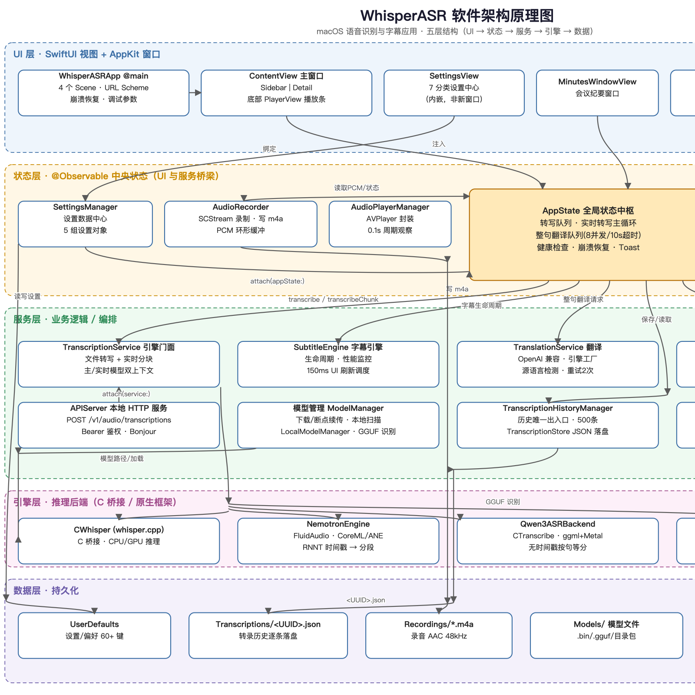
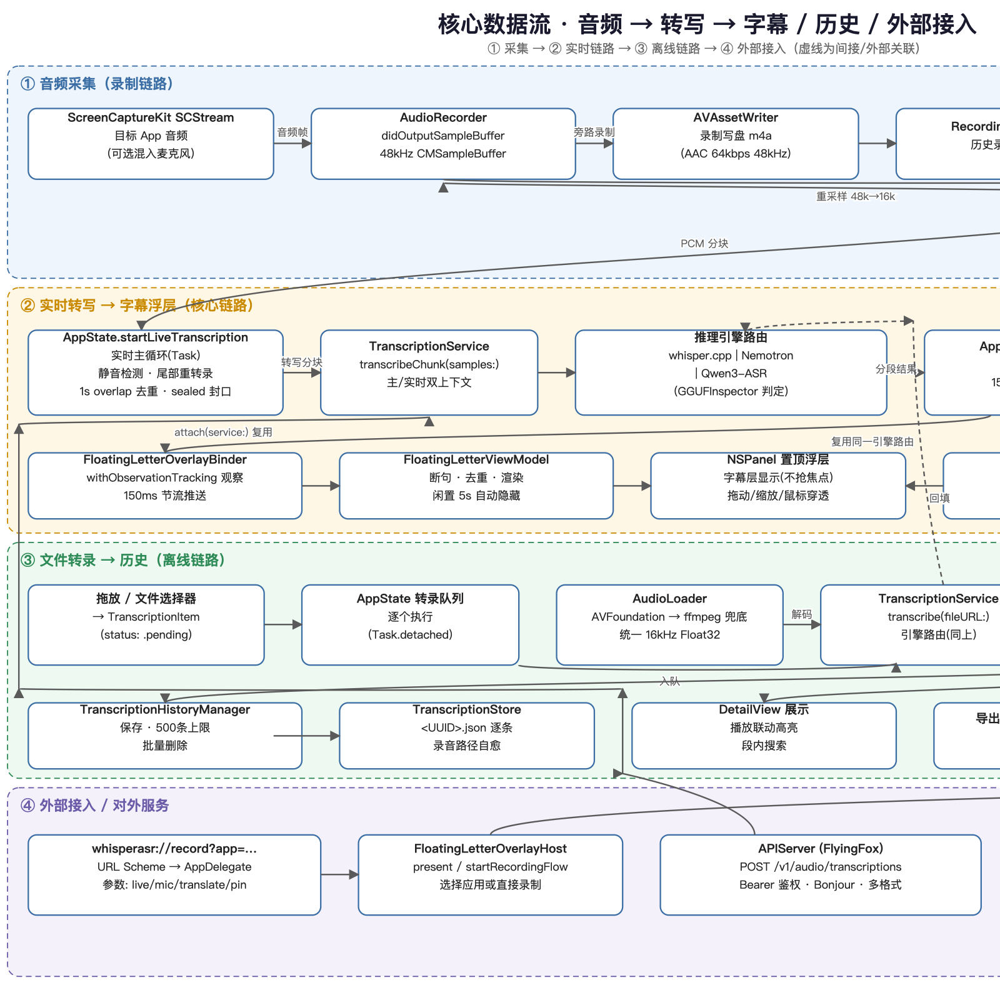
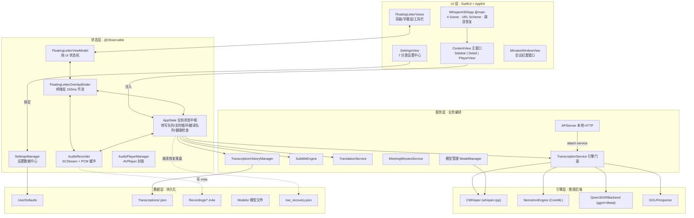
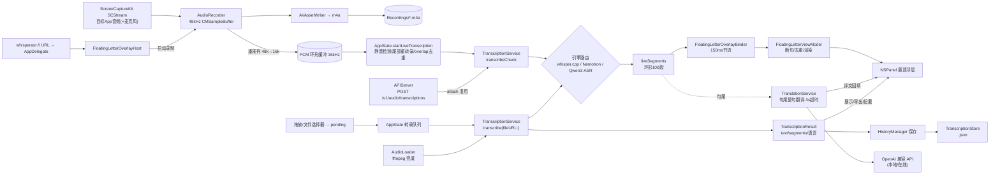

# WhisperASR 软件原理图

> 生成日期：2026-08-08（对应分支 `正式版1.4`，commit b806858）
>
> 图片由 `Scripts/gen_diagrams.py` 生成 SVG（`docs/diagrams/*.svg`），再经 `qlmanage -t -s 1600` 渲染为 PNG；重新生成：
> ```bash
> python3 Scripts/gen_diagrams.py
> cd docs/diagrams && qlmanage -t -s 1600 -o . architecture.svg dataflow.svg
> ```
> 下方附 Mermaid 源码，可直接在支持 Mermaid 的编辑器中修改。

## 一、分层架构图



### 图例（五层）

| 层 | 角色 | 关键成员 |
|---|---|---|
| UI 层 | SwiftUI 视图 + AppKit 窗口 | `WhisperASRApp`(@main) / `ContentView` / `SettingsView` / `MinutesWindowView` / `FloatingLetterViews` |
| 状态层 | @Observable 中央状态，UI 与服务的桥梁 | `AppState`(中枢) / `SettingsManager` / `AudioRecorder` / `AudioPlayerManager` / `FloatingLetterOverlayBinder` / `FloatingLetterViewModel` |
| 服务层 | 业务编排 | `TranscriptionService` / `SubtitleEngine` / `TranslationService` / `MeetingMinutesService` / `APIServer` / `ModelManager` / `TranscriptionHistoryManager` / 工具组 |
| 引擎层 | 推理后端（C 桥接 / 原生框架） | `CWhisper`(whisper.cpp) / `NemotronEngine`(CoreML) / `Qwen3ASRBackend`(ggml+Metal) / `GGUFInspector` |
| 数据层 | 持久化 | UserDefaults / `<UUID>.json` / `*.m4a` / `Models/` / `live_recovery.json` |

## 二、核心数据流图



四条链路：
1. **① 采集**：`SCStream` 捕获目标 App 音频（可混麦克风）→ `AudioRecorder` 分流为「写 m4a」与「16kHz PCM 环形缓冲」。
2. **② 实时链路（核心）**：PCM → `AppState` 实时主循环（静音检测/尾部重转录/去重）→ `TranscriptionService.transcribeChunk` → 引擎三选一 → `liveSegments` → `FloatingLetterOverlayBinder`(150ms 节流) → `FloatingLetterViewModel` → `NSPanel` 置顶浮层；句尾触发整句翻译，3s 超时回退原文。
3. **③ 离线链路**：拖放/选择器 → 转录队列 → `AudioLoader` 解码 → `transcribe(fileURL:)` → `TranscriptionResult` → `HistoryManager` → `<UUID>.json` → 详情/播放联动/导出/纪要。
4. **④ 外部接入**：`whisperasr://record` URL Scheme 直启录制；其他 App 经 `APIServer`(OpenAI 兼容 HTTP) 复用同一 `TranscriptionService`。

## 三、Mermaid 源码

### 3.1 分层架构（flowchart）



### 3.2 核心数据流（flowchart）



## 四、设计要点

1. **`AppState` 是中央枢纽**：所有链路（录制、实时转写、翻译、健康检查、历史）都汇聚于此，图中以高亮大框突出。
2. **三引擎可插拔**：`TranscriptionService` 按模型文件类型路由（目录=Nemotron；GGUF 头 `qwen3_asr`=Qwen3-ASR；否则 whisper.cpp），主模型与实时模型双上下文并存。
3. **浮层刻意解耦**：`FloatingLetter` 目录是零业务依赖的复用组件，唯一接线口是 `FloatingLetterOverlayBinder`（观察 AppState/AudioRecorder → 150ms 节流推送）。
4. **持久化分两半**：UserDefaults（设置）+ 逐条 JSON 文件（转录数据）；备份服务只覆盖前者，转录数据靠目录拷贝迁移。
5. **外部可接入**：URL Scheme 与本地 OpenAI 兼容 HTTP 服务都复用应用内同一个 `TranscriptionService`。
